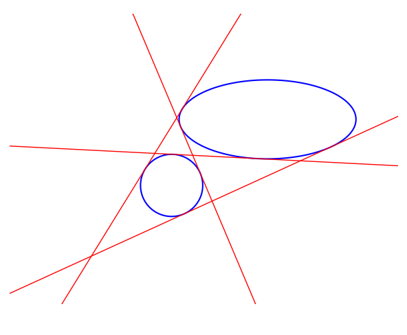

# ellipses-bitangents
Computes bitangents of 2 ellipses

---


1. Define ellipses
   - Using ellipse parametrisation
      ```python
     from entities import EllipseParams
     
      ellipse1 = Ellipse(EllipseParams(xc=2, yc=1, major_axis=7, minor_axis=2, angle=0))
      ellipse2 = Ellipse(EllipseParams(xc=-1, yc=7, major_axis=5, minor_axis=3, angle=0))
      ```
   - Using conic coefficients
      ```python
     from entities import ConicCoeffs
     
      ellipse1 = Ellipse(ConicCoeffs(a=0.5, b=0, c=2.5, d=-2.0, e=-7.0, f=5))
      ellipse2 = Ellipse(ConicCoeffs(a=4.4, b=0, c=4.4, d=1.0, e=0.5, f=-2.0))
      ```

2. Define `Finder`
   ```python
   from btan import BitangentFinder
   
   finder = BitangentFinder(ellipse1, ellipse2)
   ```

3. Compute and draw bitangents
   ```python
   bitangents = finder.compute_bitangents()
   ```

4. Draw bitangents
   ```python
   finder.draw(bitangents)
   ```


## Example
Run the example script in `src/`
```python
python src/example.py
```
using the coefficients defined in the file (and $a=c$ for the second ellipse, i.e. a circle), we get:

<p align="center">
    
</p>
