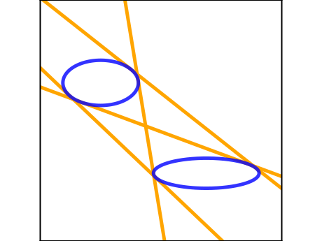
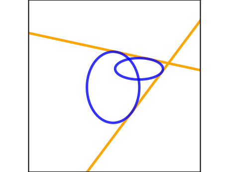

# ellipses-bitangents
Compute bitangents of 2 (intersecting or non-intersecting) ellipses.

<p align="center">
    
    

</p>

---


1. Define ellipses
   - Using ellipse parametrisation
      ```python
     from src.entities import Ellipse
     
      c1 = Ellipse(xc=3, yc=-3.5, major_axis=7, minor_axis=2, angle=0).to_conic()
      c2 = Ellipse(xc=-4, yc=2.5, major_axis=5, minor_axis=3, angle=0).to_conic()
      ```
   - Using conic coefficients
      ```python
     from src.entities import Conic
     
      c1 = Conic(a=0.5, b=0, c=2.5, d=-2.0, e=-7.0, f=5)
      c2 = Conic(a=4.4, b=0, c=2.4, d=1.0, e=0.5, f=-20.0)
      ```

2. Define `Finder`
   ```python
   from src.btan import BitangentFinder
   
   finder = BitangentFinder(c1, c2)
   ```

3. Compute bitangents
   ```python
   bitangents = finder.compute_bitangents(method="gep")
   ```

4. Draw bitangents
   ```python
   finder.draw(bitangents)
   ```


## Example
Run the example script in `src/`
```python
python src/example.py
```

## Details
The solution relies on transforming the system of 2 polynomial equations to either:
- a polynomial eigenvalue problem (PEP)
- a generalised eigenvalue problem (GEP)

## Known limits
- the current code does not handle ellipse angles well yet ($\text{angle} \neq 0$ or $b \neq 0$)